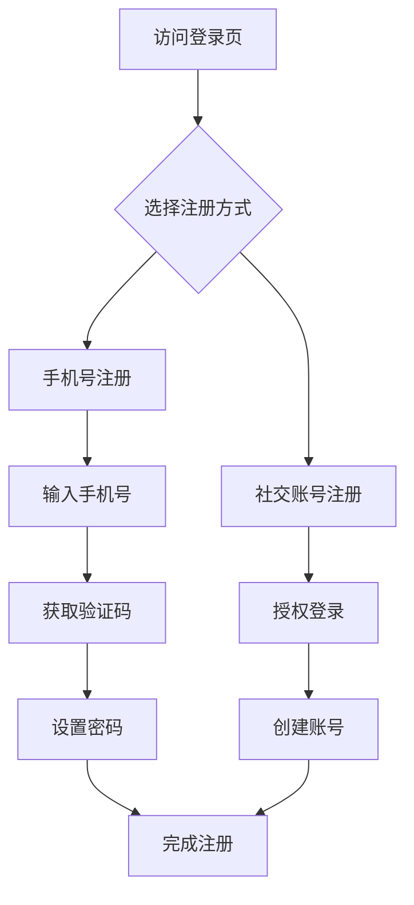

# 最小化产品需求文档 (Minimal PRD)

> 这是一个轻量级 PRD 模板，适用于敏捷开发环境。可以根据项目复杂度调整详细程度。

---

## 1. 基本信息

| 字段 | 内容 |
|------|------|
| **产品名称** | |
| **版本号** | v1.0 |
| **创建日期** | YYYY-MM-DD |
| **最后更新** | YYYY-MM-DD |
| **负责人** | |
| **状态** | [ ] 需求收集 [ ] 设计中 [ ] 开发中 [ ] 已发布 [ ] 已归档 |

---

## 2. 背景与目标

### 业务背景
* 为什么需要这个功能？
* 当前存在的问题或机会是什么？
* 这个功能如何支持公司战略目标？

**示例：**
当前用户流失率上升，调查显示复杂的注册流程是主要障碍。简化注册将提升转化率 20%，支持公司增长目标。

### 产品目标
使用 **SMART** 原则设定目标：
- **S**pecific: 
- **M**easurable: 
- **A**chievable: 
- **R**elevant: 
- **T**ime-bound: 

**示例：**
- 3个月内将新用户注册转化率从 45% 提升到 60%
- 减少 50% 的注册相关客服咨询

### 成功指标
| 指标类型 | 具体指标 | 目标值 | 衡量方法 |
|----------|----------|--------|----------|
| **业务指标** | 注册转化率 | >60% | Google Analytics |
| **用户指标** | 任务完成时间 | <2分钟 | 用户测试 |
| **技术指标** | 页面加载时间 | <2秒 | Web Vitals |

---

## 3. 用户故事

### 主要用户角色
- **主要用户**：
- **次要用户**：

### 用户故事模板
> **作为** [用户角色]，  
> **我想要** [完成某个任务]，  
> **以便于** [实现某个价值]。

### 核心用户故事
| 优先级 | 用户故事 | 接受标准 |
|--------|----------|----------|
| **P0** | 作为新用户，我想要通过手机号快速注册，以便立即开始使用应用 | |
| **P1** | 作为注册用户，我想要通过社交账号一键登录，方便快捷地进入应用 | |
| **P2** | 作为用户，我想要在忘记密码时能轻松重置，确保不会因忘记密码而无法使用应用 | |

---

## 4. 功能需求

### 核心功能流程

### 详细功能描述

#### 1. 注册页面
**功能描述：** 用户访问应用的入口页面
- [ ] 显示应用 Logo 和简介
- [ ] 提供"登录"和"注册"按钮
- [ ] 支持选择手机号或社交账号注册
- [ ] 链接到隐私政策和用户协议

**界面要求：**
- 设计风格：简洁现代
- 响应式：支持移动端和桌面端

#### 2. 手机号注册流程
**步骤 1：输入手机号**
- [ ] 验证手机号格式
- [ ] 检查手机号是否已注册
- [ ] 发送验证码按钮（60秒倒计时）

**步骤 2：验证短信**
- [ ] 输入 6 位验证码
- [ ] 实时验证格式
- [ ] 3 次错误机会后需重新获取

**步骤 3：设置密码**
- [ ] 密码强度要求（8位以上，包含字母和数字）
- [ ] 显示密码强度指示器
- [ ] 确认密码输入

#### 3. 社交账号登录
**支持平台：**
- [ ] 微信
- [ ] QQ
- [ ] Apple ID

**流程：**
- [ ] 点击对应社交平台图标
- [ ] 跳转到授权页面
- [ ] 获取用户信息
- [ ] 自动创建或登录账号

---

## 5. 非功能性需求

### 性能需求
- [ ] 页面加载时间 < 2秒
- [ ] API 响应时间 < 500ms
- [ ] 支持 1000 并发用户

### 安全需求
- [ ] 手机号脱敏存储
- [ ] 密码加密传输和存储
- [ ] 验证码 5 分钟有效期
- [ ] 防止暴力破解

### 兼容性需求
| 平台 | 最低版本 | 浏览器 |
|------|----------|--------|
| iOS | 13.0 | Safari, Chrome |
| Android | 8.0 | Chrome, Firefox |
| Web | - | Chrome 80+, Firefox 75+ |

---

## 6. 设计参考

### UI/UX 设计
- [ ] 设计稿链接：[Figma/其他工具]
- [ ] 交互原型：[链接]
- [ ] 设计规范：[链接]

### 视觉风格
- 主色调：#HEXCODE
- 字体：字体名称，字号
- 间距：最小 8px，默认 16px

---

## 7. 验收标准

### 功能验收
| 场景 | 测试步骤 | 预期结果 |
|------|----------|----------|
| **正常注册** | 1. 输入有效手机号 2. 获取验证码 3. 输入正确验证码 4. 设置有效密码 | 成功注册，跳转到首页 |
| **重复注册** | 1. 输入已注册手机号 | 提示"该手机号已注册" |
| **错误验证码** | 1. 输入错误验证码 | 提示错误，3次后锁定 |

### 数据验收
- [ ] 用户注册数据正确存储到数据库
- [ ] 验证码日志记录完整
- [ ] 注册来源数据追踪正确

---

## 8. 时间线与依赖

### 开排期
| 阶段 | 开始时间 | 结束时间 | 负责人 |
|------|----------|----------|--------|
| 需求评审 | | | |
| UI/UX 设计 | | | |
| 前端开发 | | | |
| 后端开发 | | | |
| 测试 | | | |
| 发布 | | | |

### 依赖项
- [ ] 需要短信服务支持
- [ ] 需要社交平台开发者账号
- [ ] 需要现有用户数据库

---

## 9. 风险与应对

| 风险 | 可能性 | 影响 | 应对措施 |
|------|--------|------|----------|
| 短信服务延迟 | 中 | 高 | 提前测试备用服务商 |
| 社交平台政策变更 | 低 | 高 | 使用标准 OAuth 协议 |
| 数据迁移问题 | 低 | 高 | 提前备份，制定回滚方案 |

---

## 10. 后续规划

### MVP 版本范围
包含核心的注册流程，不包含：
- [ ] 第三方账号绑定
- [ ] 企业注册
- [ ] 邀码注册

### V1.1 规划
- [ ] 支持邮箱注册
- [ ] 注册完成后引导
- [ ] A/B 测试注册流程优化

---

## 📝 备注
- 所有链接使用 `[[ ]]` 语法链接到相关文档
- 更新时修改最后的日期和版本号
- 使用 `#标签` 组织相关内容

---
**文档模板维护者：**  
**最后更新：** YYYY-MM-DD